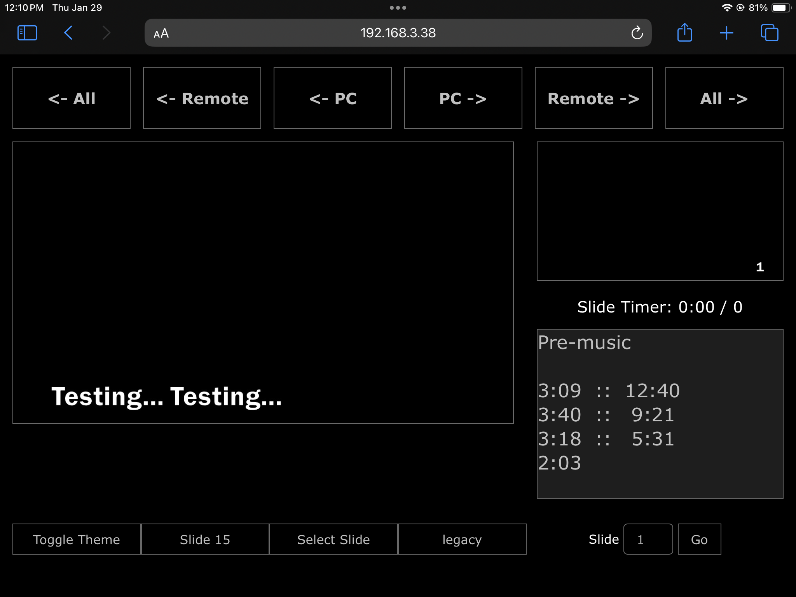
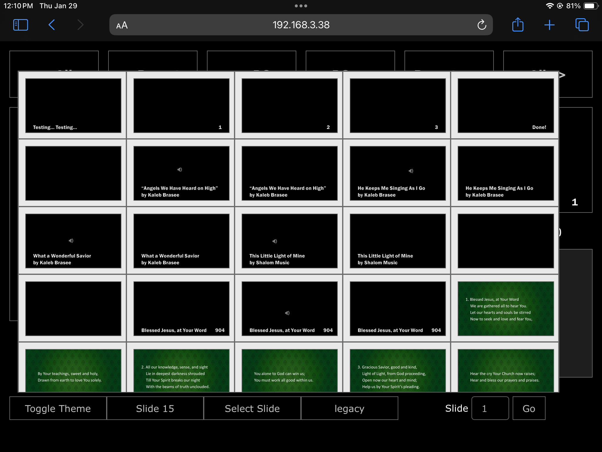
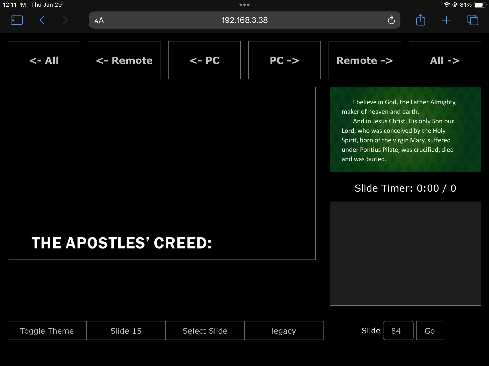

  <h1>PowerPoint Remote by AV_Nick</h1>

  

    A lightweight, network-based remote control for PowerPoint that lets you run your slideshow from any device
    on your local network—without draining system resources or requiring a live video feed. I use this tool weekly
    to lead worship, but it works beautifully for any presentation setting.
  

  

  <h2>What This App Does</h2>
  <ul>
    <li><strong>Slide previews:</strong> Shows picture copies of your PowerPoint slides on your phone, tablet, or any browser-enabled device.</li>
    <li><strong>Remote control:</strong> Advance slides remotely with simple next/previous controls.</li>
    <li><strong>Local network only:</strong> Works offline on your local network (no internet required).</li>
    <li><strong>Resource friendly:</strong> Avoids the heavy resource usage of live screen-mirroring tools.</li>
    <li><strong>Clean interface:</strong> Minimal design focused on reliability during live events.</li>
  </ul>

  

  <h2>Screenshots</h2>

  <h3>Remote Interface</h3>
  
  
  

  <h3>Example Frames from Demo Video</h3>
  
  
  

  

    <strong>Demo Video:</strong>
    <a href="https://youtu.be/b0eDuyEK6JM" target="_blank" rel="noopener noreferrer">
      https://youtu.be/b0eDuyEK6JM
    </a>
  

  

  <h2>How It Works</h2>

  

    This app uses exported slide images rather than live screen captures. That means:
  

  <ul>
    <li><strong>Zero lag</strong></li>
    <li><strong>Minimal CPU usage</strong></li>
    <li><strong>Stable performance</strong> even on older devices</li>
  </ul>

  

    You manually export your PowerPoint slides using the included VBA macro. Just update the export path in the macro
    to match where your PowerPoint Remote app is installed.
  

  

    Once exported, the remote interface loads the slide images and lets you navigate through them from any device
    connected to the same router.
  

  

  <h2>Getting Started</h2>

  <ol>
    <li>Install the PowerPoint Remote app on your computer.</li>
    <li>Run the included <strong>PowerPoint export macro</strong> to generate slide images.</li>
    <li>Connect your phone or tablet to the same local network.</li>
    <li>Open the remote interface in your browser.</li>
    <li>Start presenting!</li>
  </ol>

  
If you need help getting set up, feel free to reach out.

  

  <h2>Based On / Inspired By</h2>

  

    This project is a remix of the excellent original work by Jens Krumsieck: 
    <a href="https://github.com/JensKrumsieck/PowerPoint-Remote" target="_blank" rel="noopener noreferrer">
      https://github.com/JensKrumsieck/PowerPoint-Remote
    </a>
  

  

    Additional inspiration: 
    <a href="https://github.com/PuZhiweizuishuai/PPT-Remote-control" target="_blank" rel="noopener noreferrer">
      https://github.com/PuZhiweizuishuai/PPT-Remote-control
    </a>
  

  
  

  <h2>Notes</h2>

  

    This tool is designed to behave similarly to Clicker, but with dramatically lower resource usage.
    It’s ideal for worship services, classrooms, small events, or any situation where reliability matters
    more than fancy animations.
  

